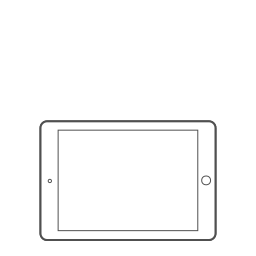
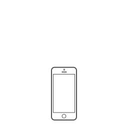
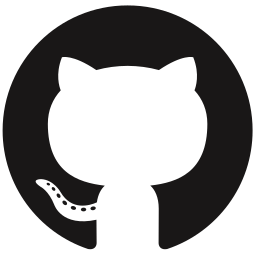
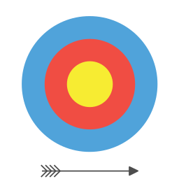
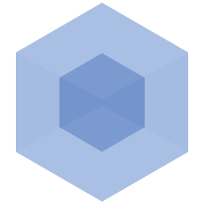
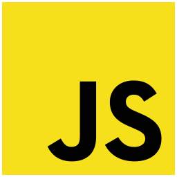
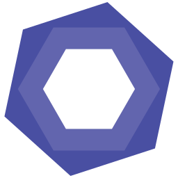
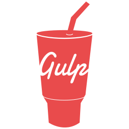

<!-- .slide: data-background-color="rgb(0, 75, 80)" data-background-image="assets/microsoft.svg" data-background-position="3.5% 93.5%" data-background-size="256px" -->

# The one trick to scaling your frontend codebase...

## Daniel Perez Alvarez
## @unindented

Note:

My name is Daniel. I'm a developer working at Microsoft, and I'm part of the frontend team building Yammer.


<!-- .slide: data-type="team" -->

- 
- 
- 
- 
- 
- 
- 

<!-- -->

- 
- 
- 
- 
- 
- 
- 
- 
- 
- 
- 
- 
- 

Note:

This is the frontend team. We've got 7 engineers in London, 12 in San Francisco, and 1 in Redmond.

This talk will go through some of the pains we've suffered while scaling our team and our codebase. The goal of the talk is to help you avoid the mistakes we made, and hopefully start a discussion on the problems and solutions others have found.


[github.com/unindented/frontend-scaling-presentation](https://github.com/unindented/frontend-scaling-presentation)

Note:

The slides for this talk, along with speaker notes, are available on my GitHub account.


<!-- .slide: data-background="rgb(0, 75, 80)" -->

## Yammer


<!-- .slide: data-background-image="assets/screenshot_yammer.png" data-background-position="center" -->

Note:

Yammer is an enterprise social network. It's just a communication tool where conversations are public by default. You join groups (shown on the left), you have threaded conversations (shown on the center), you work with files, etc.


<!-- .slide: data-background-image="assets/map_locations.svg" data-background-position="12.5% 0%" data-background-size="200%" -->

Note:

Yammer started out in San Francisco in 2008. The engineering team in London started in 2012, and the one in Redmond in 2013. We have over 200 engineers across the three offices:

- SF: 69%
- London: 18%
- Redmond: 13%


<!-- .slide: data-type="images" -->

-  66%
-  4%
-  30%

Note:

We have a web client, and native iPhone, iPad, Android, and Windows Phone clients.

Most users are accessing Yammer through our web app.


<!-- .slide: data-type="codes one-column" -->

```sh
$ cloc --exclude-dir=node_modules .

-----------------------------------------
Language    files  blank  comment    code
-----------------------------------------
Javascript   1473  40576    21197  181863
CSS           323  13762     9057  144904
HTML          194    189       57    3119
JSON           17     15        0    2034
-----------------------------------------
SUM:         2007  54542    30311  331920
-----------------------------------------
```


<!-- .slide: data-background="rgb(0, 75, 80)" -->

## How we work


<!-- .slide: data-type="images spaced" -->

-  50%
-  50%

[about.yammer.com/product/development](https://about.yammer.com/product/development/) <!-- .element: class="fragment" -->

Note:

The way we develop the product is by delivering the features in our roadmap in small increments, and by performing A/B tests on them to measure their effects.


<!-- .slide: data-background-image="assets/map_development.svg" data-background-position="12.5% 0%" data-background-size="200%" -->

Note:

We have many small, cross-functional teams working on product- or engineering-focused projects.

Once a project is finished, the team disbands and joins other projects, so we are constantly moving and working with different people.

We deploy twice a day (once from London, and once from San Francisco).


<!-- .slide: data-type="codes three-column" -->

```yaml
key: foo_v2
name: Foo (v2)
treatment_groups:
  - name: Disabled
    proportion: 100
    return_value: false
    control: true
  - name: Enabled
    proportion: 0
    return_value: true
```

```ruby
if treatment(:foo_v2)
  render partial: 'foo'
end
```

```javascript
if (treatment('foo_v2')) {
  foo = new Foo(options);
}
```

Note:

We don't wait until a feature is done to ship it to production. We hide things behind feature flags.

We can define a new feature by creating a YAML file where we describe its treatment groups. In this example, the feature has two groups, enabled and disabled. We then check from our code which treatment group a user is in, and show or hide features.

We use feature flags both for rolling out changes incrementally, and for A/B testing. When A/B testing, we randomly assign users to one treatment group or the other, and then measure each group to see how the feature affected our metrics.


- Three offices
- One product
- Constant change

Note:

To recap:

- We are distributed across three offices.
- We are all building the same product.
- Both the codebases and the teams are in constant change.


<!-- .slide: data-background="rgb(0, 75, 80)" -->

## Scaling the team


### Coordination

Note:

As I said, we have many projects going on at any point in time. We try not to have two projects working on the same area of the codebase, in order to avoid coordination costs, but sometimes it is inevitable.

When Yammer was just the San Francisco office, most communication happened face-to-face. If two teams had to coordinate, they just got together in a room.

This changed drastically in 2012 when we the London folk started. We were seeing the same problems over and over:

- London wasn't up to date on what SF was doing, and viceversa.
- People were stepping on each other's toes.
- There was a general feeling of disconnect.

I don't think there was anything wrong with us. It's just that we had become a distributed team, and we had to learn to work as such.


<!-- .slide: data-background-image="assets/screenshot_coordination.png" data-background-position="center" -->

Note:

- We went from face-to-face discussions and meetings to posting everything on Yammer. Face-to-face is still useful because of its higher bandwidth, but even then we post a summary on Yammer, so that people who were not present can follow and participate.
- Things can happen asynchronously. We don't need to interrupt other people's flow. We just post on Yammer, and they will deal with it when they have the time.
- Every conversation is searchable, and has a URL which you can reference in other posts or in documents. This makes it easier to trace back decisions that people made in the past.


### Knowledge sharing

Note:

The other big issue we encountered when we became a distributed team was sharing technical knowledge. When SF was the only office, people discussed things like code quality and best practices in person. Even though all our repos are on GitHub, we weren't making use of pull requests, because code review was generally viewed as a burdensome process that would slow us down.

After London joined in the fun, we continued working like that for about a year, but it just wasn't effective. For example, if I wanted to share a tip on how to better unit-test a piece of code, I could post on Yammer or write a wiki page, but few people would read it, and even fewer would apply it.


<!-- .slide: data-background-image="assets/screenshot_knowledge.png" data-background-position="center" -->

Note:

So we decided to try out pull requests internally, just in the London office, to verify whether they'd really slow us down. It turned out they didn't, and they proved quite effective in sharing knowledge and raising code quality, so we pushed to have them across all offices.


<!-- .slide: data-background-image="assets/map_no_volume.svg" data-background-position="12.5% 0%" data-background-size="200%" -->

Note:

So yeah, all of our problems were related to communication. In our case, it was mostly because we were in separate offices, but I guess you'd encounter similar problems with a big enough team, even if they were all in the same location.


<!-- .slide: data-type="images" -->

- 
- 
- 

<!-- -->

- 
- 

Note:

For us, scaling our team means being able to execute on multiple projects across multiple locations, while making sure that code quality improves and knowledge is shared effectively. Adopting tools and processes well suited to a distributed team helped us a ton. For us, it was Yammer and GitHub, but there are excellent alternatives like Slack or Phabricator.

It's worth noting that none of this happened overnight. Even after 3 years of working as a distributed team we are still trying to get good at this.


<!-- .slide: data-background="rgb(0, 75, 80)" -->

## Scaling the codebase


### Incremental improvement

Note:

We all know that big rewrites are almost never a good idea. But with a team distributed across three offices, where each person is working on a different project, they are just not possible.


<!-- .slide: data-background-image="assets/strata.svg" data-background-position="center" data-background-size="50%" -->

Note:

For example, in our codebase we have three different base classes for views:

- `Component` was the first attempt at views in the early days of Yammer.
- `Component2` tried to improve the API of `Component` and fix some of its issues. It is compatible with `Component`, so a `Component2` instance can live as a child of a `Component` instance, and viceversa.
- Then we tried to move away from maintaining our own framework and adopted `Backbone`. We subclassed `Backbone.View` to add a thin compatibility layer, so that these views could live as children of `Component` and `Component2` instances.

This doesn't look like fun, right? Maintaining three different abstractions, making sure old and new components play nicely with each other...

We would love to rewrite all of the old components using `Backbone.View`, but it's just not possible. We can't stop all other projects for this one thing. The cost is too big for the benefit we would get.


<!-- .slide: data-background-image="assets/life.png" data-background-position="center" data-background-size="65%" -->

Note:

Not to mention, our final state would not be as perfect as we want to think (<http://www.bonkersworld.net/building-software/>).

What we do is, we come up with a plan of how to continuously improve something over time, and then we execute on it. Sometimes we improve things as we work on product features. For example, if we are heavily modifying an area of the code that still relies on `Component` or `Component2`, we try to migrate it to `Backbone.View`. Other times we staff engineering projects, to ensure that the task is completely finished in a certain time-window.

The downside to this approach is the cognitive load of having to maintain this legacy code for long periods of time, but, at least for us, the alternatives are even worse.


### Divide and conquer


> The secret to building large apps is never build large apps.
>
> Break your applications into small pieces. Then, assemble those testable, bite-sized pieces into your big application.
>
> Justin Meyer


<!-- .slide: data-type="codes two-column" -->

```javascript
yam.views.Foo = Component.extend({
  template: '\
    <div class="yj-foo">\
      <span>{{label}}</span>\
      \
    </div>\
  ',

  init: function () {
    // ...
  }
});
```

```css
/* ... */
.yj-bar .button {/*...*/}

.yj-foo {/*...*/}

.yj-foo span {/*...*/}
.yj-foo img {/*...*/}

.yj-thread .yj-foo {/*...*/}

.yj-baz {/*...*/}
/* ... */
```

Note:

We kind of did that from the start, having components that do one thing, having one component per file, etc.

There were a few things we didn't get right:

- We used namespaces hanging off a global variable, which makes it hard to track down dependencies.
- The template would be inlined, which allowed people to use concatenation and do all sorts of gross things.
- We'd add the CSS to some random file, which would grow indefinitely.
- The CSS had all sorts of specificity issues, mainly because of our reliance on type selectors.


<!-- .slide: data-type="codes two-column" -->

```
▾ lib/
  ▾ shared/
      component.js
      component2.js
  ▸ vendor/
  ▾ views/
      foo.js
    ...
▾ spec/
  ▸ shared/
  ▾ views/
      foo_spec.js
    ...
```

```javascript
{
  "yam-public.js": [
    "lib/vendor/jquery.js",
    "lib/vendor/underscore.js",
    "lib/shared/component.js",
    "lib/shared/component2.js",
    "lib/views/foo.js",
    //...
  ],

  //...
}
```

Note:

Our folder structure was all over the place. Components were deeply nested in random subfolders.

And then we had these horrible JSON files that listed every file needed to create a certain bundle. You had to add new files by hand, making sure they appeared after all their dependencies.

This was really cumbersome, and made it hard to know whether something was still in use, or whether it could be deleted.


<!-- .slide: data-type="codes split two-column" -->

```javascript
define(function (require) {
  require('css!./foo.css');
  var tpl = require('html!./foo.html');

  return Backbone.View.extend({
    className: 'yj-foo',
    template: tpl,

    initialize: function () {
      // ...
    }
  });
});
```

```css
.yj-foo {/*...*/}

.yj-foo--label {/*...*/}
.yj-foo--mugshot {/*...*/}
```

```html
<span class="yj-foo--label">
  {{label}}
</span>

```

Note:

In 2013 we started converting JavaScript modules to AMD, and using RequireJS to build our bundles.

In 2014 we started applying dependency management to other resources like CSS and templates, not just JavaScript. We could also manage other things, like localized strings.

You can see we've adopted CSS naming conventions similar to those of [SUIT CSS](https://github.com/suitcss/suit/blob/master/doc/naming-conventions.md), to avoid specificity issues.


<!-- .slide: data-type="codes one-column" -->

```
▾ components/
  ▾ foo/
    ▾ spec/
        foo_spec.js
    ▾ src/
        foo.css
        foo.html
        foo.js
      index.js
  ▸ bar/
    ...
```

Note:

We are moving to a folder structure where all components are at the same level, and each folder contains just the JS, CSS and HTML for that particular component.

And we got rid of most of those JSON files. Once you start using dependency management, the tools do everything for you.


- Easier to maintain
- Easier to reuse
- Easier to replace

Note:

By applying this divide and conquer approach, things became:

- Easier to maintain: Keeping logical, related parts of a system together makes it easier to understand and maintain. When working with a component, we only need to keep its details in our head. We don't need to know the details of other components it interacts with. This also helps when testing and debugging the component.
- Easier to reuse: We don't want to implement the same functionality in multiple places. We try to build components that deal with a single concern, so that new components can be built by putting together existing ones.
- Easier to replace: We are experimenting all the time, which means constantly throwing away code. Replaceability is as important to us as reuse. Components enable this by keeping all the related parts together.


<!-- .slide: data-type="images spaced" -->

- 
- 
- 

Note:

RequireJS is probably not the best tool for this, but it's what we are using for now. (Personally, I'm a big fan of Webpack, as it has loaders to track all kinds of dependencies, and some of them are really smart.)


### Knowledge codification

Note:

I talked before about sharing knowledge through pull requests. Some pieces of knowledge are better shared by codifying them, i.e. by literally turning them into executable code.


<!-- .slide: data-type="images spaced" -->

- 
- 

Note:

Our team used to have a JavaScript styleguide that we asked people to follow. We wrote a wiki page and everything, but most people didn't care enough to read it, and much less memorize it and apply it.

What we ended up doing was choosing which rules we really cared about, and then we turned them into a `.jshintrc` file, committed that file, and started enforcing the rules with JSHint as part of your test suite.


<!-- .slide: data-type="images spaced" -->

- 
- 

Note:

The same happened with our build process. We had a wiki page with all the steps needed to build the different parts of our app, but we replaced it with a single Grunt task that does it all for us.


<!-- .slide: data-type="codes two-column" -->

```javascript
/**
 * Foo is used for this and that.
 * Also for this other thing.
 *
 *     var foo = new Foo();
 *     foo.add(item);
 *     ...
 */

define(function (require) {
  // ...
});
```

```javascript
define(function (require) {
  var Foo = require('../src/foo');

  describe('Foo', function () {
    describe('#add', function () {
      // ...
    });
  });
});
```

Note:

I'm also in favor of avoiding long comments in code, and instead writing (good) unit and integration tests that exercise that logic. Comments get stale, tests that get executed every day do not.


`git push`

Note:

Sharing codified knowledge is as easy as executing `git push`. Everybody on our team is up to date from the moment they pull.


<!-- .slide: data-background="rgb(0, 75, 80)" -->

## Takeaways


- Learn to work as a distributed team <!-- .element: class="fragment" -->
- Improve things incrementally <!-- .element: class="fragment" -->
- Divide your large codebase into smaller pieces <!-- .element: class="fragment" -->
- Turn knowledge into executable code <!-- .element: class="fragment" -->

Note:

I don't want to end the talk leaving you with the impression that Yammer is doing everything right, or that, if you are not doing all of these things, you are in trouble. These have worked for us. If you are in a similar situation to ours, they may work for you. In any case, I hope this talk will foster ideas in your team.

- Learn to work as a distributed team. Try different tools and processes, and keep iterating.
- Improve things incrementally. Once you get past a certain size, moving in lockstep will not be possible, so big refactors will be out of the question.
- Find a way of dividing your large codebase into smaller pieces. For us, developing self-contained components and making use of dependency management have helped tremendously.
- If a piece of knowledge can be turned into executable code, do it, as it is easier to share and keep up to date.
